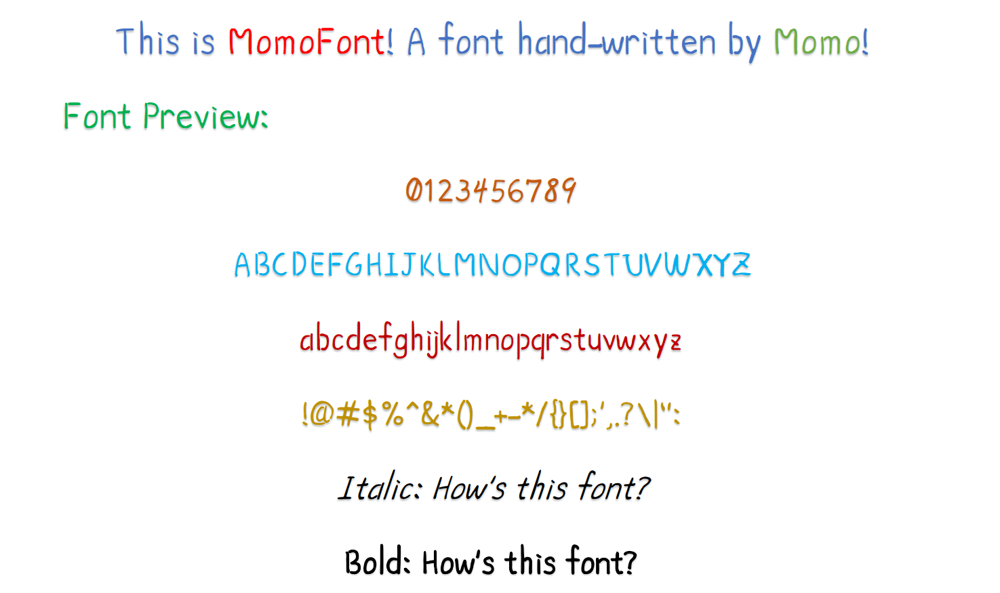

# MomoFont
An English Font created by PastFuture. Letters originally written by Momo.

## 簡介 / Introduction

MomoFont 是由 [@mo_what_](https://www.instagram.com/mo_what_/) 於2020年5月委由 [PastFuture](https://github.com/pastfuture777) 所製作。
此後因課業繁重屢未能完成專案，直至2022年再次因Omicron新冠肺炎疫情致使遠距教學，方有時間完成。
本字體採用了[守寫字](https://www.writes.com.tw/)、[Calligraphr](https://www.calligraphr.com/) 與 [BirdFont](https://birdfont.org/) 製作。

MomoFont is a font hand-written by [@mo_what_](https://www.instagram.com/mo_what_/) in May, 2020, and asked [PastFuture](https://github.com/pastfuture777) to make the font.
However, due to the massive load of curriculum pressure, not until the stroke of COVID-19 Omicron in 2022, which led to online classes can this project finally be finished.
This project is finished by using the following websites or apps: [守寫字](https://www.writes.com.tw/), [Calligraphr](https://www.calligraphr.com/) and [BirdFont](https://birdfont.org/).

## 最新版本與下載方式 / Newest Version and Download Method

目前為初發預覽版！
請點選本頁面右側「[Releases](https://github.com/pastfuture777/MomoFont/releases)」處的最新發行版本，下載 MomoFont.ttf。安裝 .ttf 字型檔案即可使用。

This is the First Release Preview version of MomoFont.
Please click [Releases](https://github.com/pastfuture777/MomoFont/releases) and choose the newest version of MomoFont.ttf, download and install it. 

## 收錄字元 / Contained Characters

* 含有基本之英文26字大小寫。
* 含有基本數字與標點。
* 其餘拉丁語系字元暫時採用MS Comic Sans **此部分之版權所有歸Microsoft Corperation所擁有，未來會陸續完成此部分的補充，敬請見諒！**

* Contained basic English characters.
* Contained basic Mathematical characters.
* Other Latin characters use MS Comic Sans as a temporary replacement. **This part of the font license and rights belongs to Microsoft Corperation. The font will be updated in the future to replace all those characters. Thanks for your understanding!**
